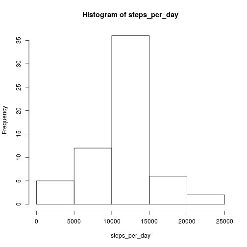

## Loading and preprocessing the data
In the following it is assumed that the working directory is the same directory that this R Markdown file is in.
The dataset can be downloaded from the link in the course web-page. If the file is not downloaded yet, the following code will do it.

```r
if (!file.exists("activity.zip")) {
    url <- "https://d396qusza40orc.cloudfront.net/repdata%2Fdata%2Factivity.zip"
    download.file(url, "activity.zip", method="curl")
}
```
The downloaded file needs to be unzipped

```r
if (!file.exists("activity.csv")) {
    unzip("activity.zip")
}
```
Reading the file into R

```r
dataset <- read.csv("activity.csv", stringsAsFactors=FALSE, na.strings="NA")
```
The date variable is a string and would be made a factor without the extra option. This is not wanted by default, since if there are missing values for some factor level and one removes the rows, the factor level still exists and appears as extra 0s, thus messing up calculations of averages etc.

## What is mean total number of steps taken per day?
Extracting the rows that have no missing values in the variables steps and date, only the variable steps contains missing values, as can be seen from the
summations over the variables

```r
sum(is.na(dataset$steps))
```

```
## [1] 2304
```

```r
sum(is.na(dataset$date))
```

```
## [1] 0
```

```r
sum(is.na(dataset$interval))
```

```
## [1] 0
```

```r
dataset2 <- dataset[!is.na(dataset$steps), ]
```
Next the total number of steps taken per day is calculated, they are drawn into a histogram and the mean and the median of the total number of steps per day are calculated

```r
dataset3 <- split(dataset2, dataset2$date)
steps_per_day <- sapply(dataset3, function(x) sum(x[, "steps"]))
hist(steps_per_day)
```

 

```r
mean(steps_per_day)
```

```
## [1] 10766.19
```

```r
median(steps_per_day)
```

```
## [1] 10765
```


## What is the average daily activity pattern?
Continuing with the dataset where the rows with missing values have been removed. Calculating the averages across days for every 5 minute interval, making a time series plot of it and finding the interval where the average amount of steps per day is maximized

```r
dataset3 <- split(dataset2, dataset2$interval)
ave_steps_per_day <- sapply(dataset3, function(x) mean(x[, "steps"]))
interval <- as.numeric(names(ave_steps_per_day))
plot(interval, ave_steps_per_day, type="l")
```

 

```r
as.numeric(names(which.max(ave_steps_per_day)))
```

```
## [1] 835
```
Comparison with the time series plot shows that maximum average number of steps is really 835 so the time of day when maximum number of steps is taken is the 5 minute period between 8.35 and 8.40 in the morning.

## Imputing missing values
It was already shown earlier that only the variable "steps" has missing values so the total number of rows with missing values can be simply calculated by

```r
sum(is.na(dataset$steps))
```

```
## [1] 2304
```
Analyzing how the missing values are distributed on the other two variables "date" and "interval"

```r
library(xtable)
missing <- dataset[is.na(dataset$steps),]
missing_date <- split(missing, missing$date)
total_missing_date <- sapply(missing_date, function(x) sum(is.na(x$steps)))
print(xtable(data.frame(total_missing_date)), type="html")
```

<!-- html table generated in R 3.1.3 by xtable 1.7-4 package -->
<!-- Tue Apr 14 00:39:30 2015 -->
<table border=1>
<tr> <th>  </th> <th> total_missing_date </th>  </tr>
  <tr> <td align="right"> 2012-10-01 </td> <td align="right"> 288 </td> </tr>
  <tr> <td align="right"> 2012-10-08 </td> <td align="right"> 288 </td> </tr>
  <tr> <td align="right"> 2012-11-01 </td> <td align="right"> 288 </td> </tr>
  <tr> <td align="right"> 2012-11-04 </td> <td align="right"> 288 </td> </tr>
  <tr> <td align="right"> 2012-11-09 </td> <td align="right"> 288 </td> </tr>
  <tr> <td align="right"> 2012-11-10 </td> <td align="right"> 288 </td> </tr>
  <tr> <td align="right"> 2012-11-14 </td> <td align="right"> 288 </td> </tr>
  <tr> <td align="right"> 2012-11-30 </td> <td align="right"> 288 </td> </tr>
   </table>
For the variable interval we do not show the results, since there would be 288 rows of them, but the code for producing the results is below

```r
missing_interval <- split(missing, missing$interval)
total_missing_interval <- sapply(missing_interval, function(x) sum(is.na(x$steps)))
print(xtable(data.frame(total_missing_interval)), type="html")
```
The total number of 5 minute intervals in a day is

```r
length(unique(dataset$interval))
```

```
## [1] 288
```
Since the number of missing values on a day containing missing values equals the number of 5 minute intervals within a day, the missing values are for a whole day, altogether 8 days. Because of this it is best to replace the missing values by an average of a 5 minute interval calculated across days. Forming a new dataset where the missing values have been replaced by the mean over days in the corresponding interval

```r
dataset_imputed <- dataset
for (i in seq_along(dataset_imputed$steps)) {
    if (is.na(dataset_imputed$steps[i])) {
        dataset_imputed$steps[i] <- ave_steps_per_day[as.character(dataset_imputed$interval[i])]
    }
}
```
Checking that the missing values have indeed been removed

```r
sum(is.na(dataset_imputed$steps))
```

```
## [1] 0
```
Checking that the imputed data contains the same number of rows as the original

```r
nrow(dataset_imputed)
```

```
## [1] 17568
```

```r
nrow(dataset)
```

```
## [1] 17568
```
Using now the dataset with missing values imputed the calculation of total number of steps per day, making of the histogram and calculations of the mean and median of the total number of steps per day is repeated

```r
dataset_imp_2 <- split(dataset_imputed, dataset_imputed$date)
steps_per_day <- sapply(dataset_imp_2, function(x) sum(x[, "steps"]))
hist(steps_per_day)
```

 

```r
mean(steps_per_day)
```

```
## [1] 10766.19
```

```r
median(steps_per_day)
```

```
## [1] 10766.19
```
Comparing to the previous results it is seen that in the histogram the middle bar has become higher than previously, the mean is still the same, which is not surprising because of the imputation by means, and finally the median equals the mean so it has increased from the previous result.

## Are there differences in activity patterns between weekdays and weekends?
The dates need to be changed to date time format. For this a new variable is created

```r
dates <- strptime(dataset_imputed$date, "%Y-%m-%d")
```
This variable is used for adding a new variable to the imputed dataset that contains information about whether the day is a weekday or weekend

```r
Sys.setlocale("LC_TIME", "en_US.UTF-8")
```

```
## [1] "en_US.UTF-8"
```

```r
days <- NULL
for (i in seq_along(dates)) {
    day <- weekdays(dates[i])
    if (day == "Saturday" | day == "Sunday") {
        days <- rbind(days, "weekend")
    } else {
        days <- rbind(days, "weekday")
    }
}
dataset_imputed$week_day_end <- as.factor(days)
```
This is used for calculating the average numbers of steps in the 5 minute intervals averaged over the weekdays or weekends and plotting the time series in the panel. First the averages are calculated by splitting the data with respect to the interval and the new variable "week_day_end" and then taking average. The resulting vector has names for its rows corresponding to the factor structure and these rownames are split and then the result is transformed to a matrix and combined with the calculated averages to form a data.frame that is finally plotted.

```r
library(lattice)
dataset_imp_2 <- split(dataset_imputed, list(dataset_imputed$interval, dataset_imputed$week_day_end))
dataset_imp_3 <- sapply(dataset_imp_2, function(x) mean(x[, "steps"]))
namevector <- names(dataset_imp_3)
int_week <- strsplit(namevector, ".", fixed=TRUE)
ave_steps_per_day <- data.frame(matrix(unlist(int_week), ncol=2, byrow=TRUE), stringsAsFactors=FALSE)
ave_steps_per_day <- cbind(dataset_imp_3, ave_steps_per_day)
names(ave_steps_per_day) <- c("ave_steps", "interval", "week_day_end")
rownames(ave_steps_per_day) <- NULL
ave_steps_per_day$interval <- as.numeric(ave_steps_per_day$interval)
xyplot(ave_steps ~ interval | week_day_end, ave_steps_per_day, layout=c(1, 2), type="l")
```

 
